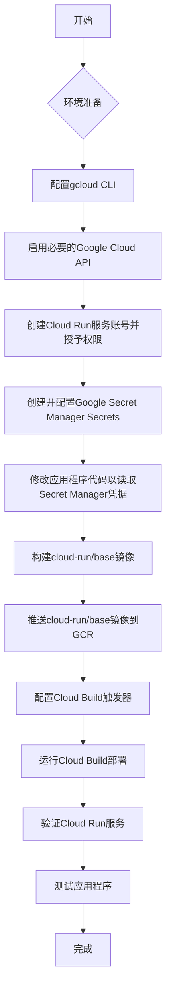

# Google Cloud Run 部署计划

## 项目架构分析

该项目旨在通过 Google Cloud Run 实现无服务器算法交易，并与盈透证券 (Interactive Brokers, IB) 集成。它由两个主要的 Docker 镜像组成：

1.  **`cloud-run/base` 镜像：**
    *   这是一个基础镜像，基于 `python:3.9-slim`。
    *   它安装了运行 IB Gateway 所需的所有系统依赖项（如 `wget`, `unzip`, `xvfb`, `libxtst6`, `libxrender1`, `openjfx` 等）。
    *   它下载并安装 IB TWS (Trader Workstation) 或 IB Gateway。
    *   它下载并解压 IBC (Interactive Brokers Console)，这是一个用于自动化 IB Gateway 登录和管理的工具。
    *   它复制了 IBC 的 `config.ini` 和 Jts 的 `jts.ini` 配置文件。
    *   它设置了 `DISPLAY` 环境变量，这对于运行图形界面的 IB Gateway 是必需的。
    *   `CMD tail -f /dev/null` 表明这个基础镜像本身不会运行任何应用程序，它只是提供一个包含 IB Gateway 和 IBC 的环境。

2.  **`cloud-run/application` 镜像：**
    *   这个镜像是基于 `cloud-run/base` 镜像构建的。
    *   它将 Python 应用程序代码（位于 `app` 目录）复制到镜像中。
    *   它安装了 Python 应用程序所需的依赖项（通过 `requirements.txt`）。
    *   `CMD ./cmd.sh` 表明应用程序的入口点是 `cmd.sh` 脚本，该脚本会启动 `Xvfb` 和 `gunicorn` 来运行 `main:app`。

## 部署流程 (通过 `cloudbuild.yaml`)

`cloudbuild.yaml` 文件定义了使用 Google Cloud Build 部署应用程序的自动化流程：

*   **构建和推送 Docker 镜像：** 如果 `cloud-run/application` 镜像的特定版本（由 `SHORT_SHA` 标识）不存在，Cloud Build 会构建它并推送到 Google Container Registry (GCR)。
*   **运行安全检查：** 使用 `safety` 工具检查 Python 依赖项是否存在已知的安全漏洞。
*   **运行单元测试：** 在 Docker 镜像中运行 Python 单元测试。
*   **运行集成测试：** 在 Docker 镜像中运行集成测试。这可能涉及到与 IB Gateway 的交互，因为 `Xvfb` 被用来模拟显示环境。
*   **部署新修订版：** 使用 `gcloud run deploy` 命令将应用程序部署到 Google Cloud Run。
    *   服务名称为 `ib-${_TRADING_MODE}`。
    *   使用之前构建的 Docker 镜像。
    *   指定区域 (`_GCP_REGION`)、平台 (`managed`)、最大实例数 (`1`)、内存限制 (`2Gi`) 和服务账号。
    *   设置修订版后缀和标签。
    *   设置环境变量 `PROJECT_ID` 和 `TRADING_MODE`。
*   **删除旧修订版：** 根据 `_KEEP` 变量（默认为 3），删除旧的 Cloud Run 修订版和不再被任何修订版引用的 Docker 镜像，以节省资源。

## 部署到 Google Cloud Run 的详细步骤



### 详细步骤：

1.  **环境准备**
    *   **登录 gcloud CLI：**
        ```bash
        gcloud auth login
        gcloud config set project [YOUR_PROJECT_ID]
        ```
        将 `[YOUR_PROJECT_ID]` 替换为你的 Google Cloud 项目 ID。
    *   **启用必要的 Google Cloud API：**
        ```bash
        gcloud services enable cloudbuild.googleapis.com \
                                run.googleapis.com \
                                containerregistry.googleapis.com \
                                iam.googleapis.com \
                                secretmanager.googleapis.com # 启用 Secret Manager API
        ```
    *   **创建 Cloud Run 服务账号并授予权限：**
        `cloudbuild.yaml` 中指定了一个名为 `ib-trading@[PROJECT_ID].iam.gserviceaccount.com` 的服务账号。你需要确保这个服务账号存在，并且拥有部署 Cloud Run 服务所需的权限（例如 `Cloud Run Admin` 和 `Service Account User`）。如果不存在，请创建它：
        ```bash
        gcloud iam service-accounts create ib-trading \
            --display-name "IB Trading Cloud Run Service Account"
        ```
        然后，授予必要的权限：
        ```bash
        gcloud projects add-iam-policy-binding [YOUR_PROJECT_ID] \
            --member "serviceAccount:ib-trading@[YOUR_PROJECT_ID].iam.gserviceaccount.com" \
            --role "roles/run.admin"
        gcloud projects add-iam-policy-binding [YOUR_PROJECT_ID] \
            --member "serviceAccount:ib-trading@[YOUR_PROJECT_ID].iam.gserviceaccount.com" \
            --role "roles/iam.serviceAccountUser"
        # 授予访问 Secret Manager 的权限
        gcloud projects add-iam-policy-binding [YOUR_PROJECT_ID] \
            --member "serviceAccount:ib-trading@[YOUR_PROJECT_ID].iam.gserviceaccount.com" \
            --role "roles/secretmanager.secretAccessor"
        ```
        你可能还需要根据应用程序的需求授予其他权限，例如访问 Pub/Sub。

2.  **创建并配置 Google Secret Manager Secrets**
    *   为了安全地存储 IB Gateway 的用户名和密码，建议使用 Google Secret Manager。
    *   创建 Secret：
        ```bash
        echo -n "your_ib_username" | gcloud secrets create ib-gateway-username --data-file=-
        echo -n "your_ib_password" | gcloud secrets create ib-gateway-password --data-file=-
        ```
        将 `your_ib_username` 和 `your_ib_password` 替换为你的实际凭据。
    *   授予 Cloud Run 服务账号访问这些 Secret 的权限：
        ```bash
        gcloud secrets add-iam-policy-binding ib-gateway-username \
            --member "serviceAccount:ib-trading@[YOUR_PROJECT_ID].iam.gserviceaccount.com" \
            --role "roles/secretmanager.secretAccessor"
        gcloud secrets add-iam-policy-binding ib-gateway-password \
            --member "serviceAccount:ib-trading@[YOUR_PROJECT_ID].iam.gserviceaccount.com" \
            --role "roles/secretmanager.secretAccessor"
        ```

3.  **修改应用程序代码以读取 Secret Manager 凭据**
    *   应用程序的 Python 代码（可能在 [`cloud-run/application/app/lib/environment.py`](cloud-run/application/app/lib/environment.py) 或 [`cloud-run/application/app/lib/ibgw.py`](cloud-run/application/app/lib/ibgw.py) 中）需要被修改以读取 `IB_USERNAME` 和 `IB_PASSWORD` 环境变量，并将其用于 IBC 配置。
    *   具体修改可能涉及：
        *   在 `lib/environment.py` 或 `lib/ibgw.py` 中添加代码，从 `os.environ` 读取 `IB_USERNAME` 和 `IB_PASSWORD`。
        *   将这些值传递给 IBC 配置，例如更新 `ibc_config` 字典。
    *   **注意：** 这部分修改将在切换到 `code` 模式后进行。

4.  **构建基础镜像 (`cloud-run/base`)**
    *   进入 `cloud-run/base` 目录：
        ```bash
        cd cloud-run/base
        ```
    *   构建 Docker 镜像：
        ```bash
        docker build -t eu.gcr.io/[YOUR_PROJECT_ID]/cloud-run/base:latest .
        ```
        你可以选择一个有意义的标签，例如 `latest` 或一个版本号。
    *   推送镜像到 Google Container Registry (GCR)：
        ```bash
        docker push eu.gcr.io/[YOUR_PROJECT_ID]/cloud-run/base:latest
        ```
    *   返回项目根目录：
        ```bash
        cd ../..
        ```

    **修正：创建 Artifact Registry 仓库：**

    ```
    gcloud artifacts repositories create cloud-run-repo \
        --repository-format=docker \
        --location=europe \
        --description="Docker repository for Cloud Run applications"
    ```


    请注意，cloudbuild.yaml 中使用了 europe-docker.pkg.dev，因此仓库位置必须是 europe。

    配置 Docker 认证：

    ```
    gcloud auth configure-docker europe-docker.pkg.dev
    ```


    这将配置 Docker 客户端以使用您的 Google Cloud 凭据向 Artifact Registry 进行身份验证。

以上几个步骤是在建立触发器之前要先运行的？。


5.  **配置 Cloud Build 触发器**
    *   为了自动化部署，建议在 Google Cloud Console 中为你的代码仓库设置一个 Cloud Build 触发器。
    *   导航到 Cloud Build -> Triggers。
    *   点击 "CREATE TRIGGER"。
    *   配置触发器：
        *   **Name:** 例如 `ib-trading-cloud-run-deploy`
        *   **Region:** 选择一个区域（例如 `global` 或与你的 Cloud Run 服务相同的区域）
        *   **Event:** `Push to a branch`
        *   **Source:** 选择你的代码仓库和目标分支（例如 `main` 或 `master`）
        *   **Build configuration:** `Cloud Build configuration file (yaml or json)`
        *   **Cloud Build file location:** `cloud-run/application/cloudbuild.yaml`
        *   **Substitutions:** 添加以下替换变量：
            *   `_TRADING_MODE`: `paper`
            *   `_GCP_REGION`: `asia-east1`
    *   保存触发器。每次推送到指定分支时，Cloud Build 都会自动运行部署流程。

6.  **运行 Cloud Build 部署**
    *   如果你已经设置了 Cloud Build 触发器，只需将代码推送到配置的分支即可触发部署。
    *   如果你想手动触发，可以使用以下命令：
        <!-- ```bash
        gcloud builds submit --config cloud-run/application/cloudbuild.yaml \
            --substitutions=_TRADING_MODE=paper,_GCP_REGION=asia-east1 \
            .
        ```
        请确保 `_TRADING_MODE` 和 `_GCP_REGION` 的值与你的需求一致。 -->

        ```bash 
        GIT_TAG=$(git rev-parse --short HEAD)
        
        then:
        
        gcloud builds submit --config cloud-run/application/cloudbuild.yaml \
        --substitutions=_TRADING_MODE=paper,_GCP_REGION=asia-east1,_MY_IMAGE_TAG=${GIT_TAG:-manual-latest} .
        ```
7.  **验证 Cloud Run 服务**
    *   部署完成后，你可以在 Google Cloud Console 的 Cloud Run 页面查看你的服务状态。
    *   服务名称将是 `ib-paper` (如果 `_TRADING_MODE` 是 `paper`)。
    *   确认服务状态为 "Ready"。

8.  **配置 Cloud Run 环境变量和 Secrets**
    *   部署后，你需要更新 Cloud Run 服务以从 Secret Manager 访问 IB Gateway 凭据。
    *   使用以下命令更新服务，将 Secret 挂载为环境变量：
        ```bash
        gcloud run services update ib-paper \
            --region asia-east1 \
            --update-secrets=IB_CREDENTIALS_JSON=paper:latest \
            --set-env-vars=TRADING_MODE=paper # 确保 TRADING_MODE 也被设置
        ```
        将 `asia-east1` 替换为你的部署区域。

9.  **测试应用程序**
    *   Cloud Run 服务会有一个 URL。你可以通过访问该 URL 来测试你的应用程序。
    *   例如，你可以使用 `curl` 命令来测试不同的 `intent`：
        ```bash
        # 获取服务 URL
        SERVICE_URL=$(gcloud run services describe ib-paper --region asia-east1 --format="value(status.url)")

        # 获取身份令牌
        TOKEN=$(gcloud auth print-identity-token)

        # 测试 summary 意图
        curl -X GET -H "Authorization: Bearer ${TOKEN}" "${SERVICE_URL}/summary"

        # 测试 allocation 意图 (示例，根据实际需求修改请求体)
        curl -X POST -H "Content-Type: application/json" -H "Authorization: Bearer ${TOKEN}" -d '{"dryRun": true, "strategies": ["dummy"]}' "${SERVICE_URL}/allocation"
        ```
        将 `YOUR_CLOUD_RUN_SERVICE_URL` 替换为你的 Cloud Run 服务的实际 URL。
    *   检查 Cloud Run 服务的日志，以确保应用程序正常启动并运行，并且交易逻辑按预期执行。

10. **出现禁止访问错误**
    *   希望服务只能通过身份验证的客户端访问。这是一个更安全的做法。

    为了实现这一点，您需要授予将用于访问 Cloud Run 服务的身份（例如，您的用户账号或一个服务账号）Cloud Run Invoker 角色。

    以下授予 Cloud Run Invoker 角色：

    *   如果您想使用当前登录的 Cloud Shell 用户账号来测试访问，请运行以下命令：
        
        ```bash
        gcloud run services add-iam-policy-binding ib-paper \
            --member="user:[YOUR_GCLOUD_EMAIL]" \
            --role="roles/run.invoker" \
            --region="asia-east1"
        ```

    将 [YOUR_GCLOUD_EMAIL] 替换为您的 Google Cloud 账号邮箱地址。

    *   使用身份验证的 curl 请求测试：

    *    一旦您授予了权限，您可以使用 gcloud auth print-identity-token 命令获取一个身份令牌，并将其包含在 curl 请求的 Authorization 头中。
    *   运行以下命令来测试 summary 意图：

        ```bash
        TOKEN=$(gcloud auth print-identity-token)
        curl -X GET -H "Authorization: Bearer ${TOKEN}" "https://ib-paper-599151217267.asia-east1.run.app/summary"
        ```