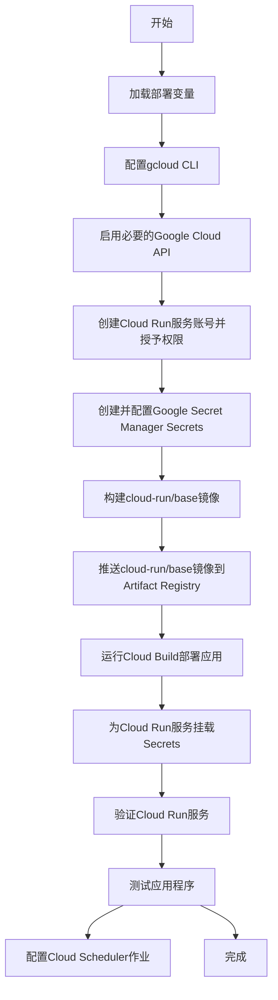

# Google Cloud Run 部署计划 (最终详尽说明版)

## 1. 项目架构分析

该项目旨在通过 Google Cloud Run 实现无服务器算法交易，并与盈透证券 (Interactive Brokers, IB) 集成。其核心是两个协同工作的 Docker 镜像：

*   **`base` 镜像**: 提供一个包含 IB Gateway 和 IBC (自动化管理工具) 的基础环境。
*   **`application` 镜像**: 基于 `base` 镜像，包含所有 Python 交易逻辑、API 和策略。

当部署时，`application` 镜像在一个容器内同时运行 IB Gateway 进程和 Python 应用。两者通过内部网络 (`127.0.0.1`) 通信。

## 2. 部署流程 (通过 `cloudbuild.yaml`)

`cloudbuild.yaml` 文件定义了使用 Google Cloud Build 部署应用程序的自动化流程，主要步骤包括：构建镜像、运行测试、部署到 Cloud Run。

## 3. 部署到 Google Cloud Run 的详细步骤

**重要提示**: 在开始以下步骤之前，请确保您已经创建并填写了 `deployment_vars.sh` 文件，然后运行以下命令加载所有必需的环境变量：

```bash
# 此命令会读取 deployment_vars.sh 文件，并将其中的 export 变量设置到您当前的终端会话中。
source deployment_vars.sh
```

加载后，本指南中的所有命令都可以直接复制和粘贴来执行。



### 步骤 1: 环境准备

*   **登录 gcloud CLI 并设置项目：**
    *   **目的**: 验证您的用户身份，并指定后续所有gcloud命令在哪个GCP项目中执行。
    ```bash
    gcloud auth login
    gcloud config set project ${PROJECT_ID}
    ```

*   **启用必要的 Google Cloud API：**
    *   **目的**: 在您的GCP项目中“激活”本次部署所需用到的各项云服务。
    ```bash
    gcloud services enable cloudbuild.googleapis.com run.googleapis.com artifactregistry.googleapis.com iam.googleapis.com secretmanager.googleapis.com
    ```

*   **创建 Cloud Run 服务账号并授予权限：**
    *   **目的**: 创建一个专用的“机器人”账号 (`Service Account`)，您的Cloud Run服务将使用这个身份来访问其他GCP资源，而不是使用您的个人账户，这是一种安全最佳实践。
    ```bash
    # 创建一个名为 ib-trading 的服务账号
    gcloud iam service-accounts create ${SERVICE_NAME_BASE} --display-name="IB Trading Service Account"

    # 为这个“机器人”账号授予三个关键权限：
    # 1. roles/run.admin: 管理Cloud Run服务的权限。
    # 2. roles/iam.serviceAccountUser: 作为服务账号被其他服务使用的权限。
    # 3. roles/secretmanager.secretAccessor: 从Secret Manager中读取密钥的权限。
    gcloud projects add-iam-policy-binding ${PROJECT_ID} --member="serviceAccount:${SERVICE_ACCOUNT_EMAIL}" --role="roles/run.admin"
gcloud projects add-iam-policy-binding ${PROJECT_ID} --member="serviceAccount:${SERVICE_ACCOUNT_EMAIL}" --role="roles/iam.serviceAccountUser"
gcloud projects add-iam-policy-binding ${PROJECT_ID} --member="serviceAccount:${SERVICE_ACCOUNT_EMAIL}" --role="roles/secretmanager.secretAccessor"
    ```

### 步骤 2: 创建并配置 Secret Manager

*   **目的**: 创建一个云端的“保险库”，用于安全地存储您的IB用户名和密码，避免硬编码在代码中。

```bash
# 创建一个名为 ib-paper-credentials (或您在vars文件中定义的名称) 的Secret“保险库”。
gcloud secrets create ${SECRET_NAME} --replication-policy="automatic" --project="${PROJECT_ID}"

# 将您的IB用户名和密码以JSON格式，存入该“保险库”的第一个版本中。
printf '{"userid": "%s", "password": "%s"}' "${IB_USERNAME}" "${IB_PASSWORD}" | gcloud secrets versions add ${SECRET_NAME} --data-file=-
```

### 步骤 3: 理解凭据处理架构 (重要概念)

此步骤仅为说明，无需操作。理解正确的凭据处理流程至关重要。

当前的架构更为安全和健壮。凭据的处理流程如下：
1.  我们将 Secret Manager 中的凭据作为**环境变量**安全地挂载到 Cloud Run 容器中 (见步骤8)。
2.  容器启动时运行的 `gatewaystart.sh` 脚本会读取这些环境变量 (`IB_USER`, `IB_PASSWORD`)。
3.  `gatewaystart.sh` 使用这些凭据来登录 IB Gateway。
4.  Python 应用启动时，只需连接到一个**已经完成登录**的本地 Gateway 即可，完全不接触任何密码。

### 步骤 4: 构建基础镜像 (`cloud-run/base`)

*   **目的**: 创建并上传一个包含IB Gateway运行环境的Docker基础镜像。此步骤只需在您想升级IB Gateway版本时执行一次。

```bash
# 在GCP上创建一个私有的Docker镜像仓库，名为cloud-run-repo。
gcloud artifacts repositories create "${REPO_NAME}" --repository-format=docker --location="${GCP_REGION}"

# 配置本地的Docker客户端，使其获得向您GCP私有仓库推送镜像的权限。
gcloud auth configure-docker "${GCP_REGION}-docker.pkg.dev"

# 进入base目录，构建镜像，并将其推送到您在GCP上的私有仓库中。
cd cloud-run/base
docker build -t "${DOCKER_REPO_URL}/base:latest" .
docker push "${DOCKER_REPO_URL}/base:latest"
cd ../..
```

### 步骤 5: 配置 Cloud Build 触发器

*   **目的**: 实现CI/CD，当您将代码推送到Git仓库时，自动触发后续的测试和部署流程。

为了自动化部署，建议在 Google Cloud Console 中为你的代码仓库设置一个 Cloud Build 触发器。导航到 Cloud Build -> Triggers，点击 "CREATE TRIGGER" 并按照界面提示进行配置。

### 步骤 6: 运行 Cloud Build 部署

*   **目的**: 手动触发一次构建和部署流程，以部署您的交易应用。
*   **说明**: 此命令会打包您当前目录的所有代码，上传到GCP，然后根据 `cloud-run/application/cloudbuild.yaml` 文件中定义的步骤，在云端执行构建、测试和部署。

```bash
# 确保您位于项目根目录 (ib-trading)
gcloud builds submit --config cloud-run/application/cloudbuild.yaml .
```

### 步骤 7: 验证 Cloud Run 服务

部署完成后，你可以在 Google Cloud Console 的 Cloud Run 页面查看你的服务状态。服务名称将是 `${CLOUD_RUN_SERVICE_NAME}`。确认服务状态为 "Ready"。

### 步骤 8: 为Cloud Run服务挂载凭据 (关键安全步骤)

*   **目的**: 将您存储在“保险库”(Secret Manager)中的IB凭据，安全地传递给正在运行的Cloud Run服务。

首次部署后，服务已经运行，但还无法登录 IB Gateway。我们需要通过更新服务，将 Secret Manager 中的凭据作为环境变量注入到容器中。

```bash
# 此命令会更新您的Cloud Run服务，从Secret Manager中拉取凭据，并创建两个只有容器内部能看到的环境变量：IB_USER和IB_PASSWORD。
gcloud run services update ${CLOUD_RUN_SERVICE_NAME} --region ${GCP_REGION} \
  --set-secrets="IB_USER=${SECRET_NAME}:userid,IB_PASSWORD=${SECRET_NAME}:password"
```

### 步骤 9: 测试应用程序

*   **目的**: 在配置好调度器之前，手动调用API，确保整个系统端到端运行通畅。

1.  **获取服务 URL 和认证令牌**
    *   **说明**: 第一个命令获取您服务的公开访问URL并存入变量。第二个命令为您的用户身份生成一个临时的、安全的访问令牌。
    ```bash
    export SERVICE_URL=$(gcloud run services describe ${CLOUD_RUN_SERVICE_NAME} --region ${GCP_REGION} --project ${PROJECT_ID} --format="value(status.url)")
    export TOKEN=$(gcloud auth print-identity-token)
    echo "Service URL set to: ${SERVICE_URL}"
    ```

2.  **测试 `/summary` 端点**
    *   **说明**: 使用curl工具，带上认证令牌，向`/summary`端点发送一个GET请求。这是最基础的连通性测试。
    ```bash
    curl -H "Authorization: Bearer ${TOKEN}" "${SERVICE_URL}/summary"
    ```
    如果看到返回的账户信息，则代表系统已成功连接并登录 IB Gateway。

3.  **测试 `/testsignalgenerator` 意图**
    *   **说明**: 这是当前部署在 Cloud Run 上的验证策略。加入 `dryRun: true` 可避免真实下单，仅用于验证信号。
    ```bash
    curl -X POST -H "Content-Type: application/json" -H "Authorization: Bearer ${TOKEN}" \
      -d '{"dryRun": true}' \
      "${SERVICE_URL}/testsignalgenerator"
    ```

### 步骤 10: 解决403禁止访问错误

*   **目的**: 这是一个常见的故障排除步骤。如果测试时返回403错误，说明您当前的用户没有权限调用该服务。

```bash
# 此命令为您的个人GCP账户授予调用该Cloud Run服务的权限。
gcloud run services add-iam-policy-binding ${CLOUD_RUN_SERVICE_NAME} \
    --member="user:${USER_EMAIL_ACCOUNT}" \
    --role="roles/run.invoker" \
    --region="${GCP_REGION}"
```

### 附录 A: 高级测试：其他意图

#### `close-all`

*   **目的**: 平掉所有指定策略的持仓。
*   **方法**: `POST`
*   **命令**:
    ```bash
    # 模拟计算平掉 spymacdvixy 策略持仓所需的交易
    curl -X POST -H "Content-Type: application/json" -H "Authorization: Bearer ${TOKEN}" \
      -d '{"dryRun": true, "strategies": ["spymacdvixy"]}' \
      "${SERVICE_URL}/close-all"
    ```

#### `reconcile`

*   **目的**: 手动将系统内部存储的持仓与券商的真实持仓同步。
*   **方法**: `GET`
*   **命令**:
    ```bash
    curl -H "Authorization: Bearer ${TOKEN}" "${SERVICE_URL}/reconcile"
    ```

#### `trade-reconciliation`

*   **目的**: 写入最新的持仓快照。成交审计逻辑仍在调试阶段，如遇异常可忽略。
*   **方法**: `POST`
*   **命令**:
    ```bash
    curl -X POST -H "Authorization: Bearer ${TOKEN}" -H "Content-Type: application/json" \
      -d '{}' \
      "${SERVICE_URL}/trade-reconciliation"
    ```

#### `cash-balancer`

*   **目的**: 将非基础货币的现金余额换回基础货币。
*   **方法**: `POST`
*   **命令**:
    ```bash
    # 模拟计算所需的现金转换交易
    curl -X POST -H "Content-Type: application/json" -H "Authorization: Bearer ${TOKEN}" \
      -d '{"dryRun": true}' \
      "${SERVICE_URL}/cash-balancer"
    ```

### 附录 B: 生产场景的 Cloud Scheduler 配置

*   **目的**: 创建云端的定时任务（Cron Job），以便自动触发当前已经部署的验证策略。

#### 验证策略：`testsignalgenerator`

*   **说明**: 以下命令创建一个名为 `nightly-test-signal` 的作业，在美东时间每个交易日下午4:15 触发一次 `dryRun` 请求，用于验证策略信号而不真实下单。

```bash
gcloud scheduler jobs create http nightly-test-signal --project=${PROJECT_ID} \
    --location=${GCP_REGION} \
    --schedule="15 16 * * 1-5" \
    --time-zone="America/New_York" \
    --uri="${SERVICE_URL}/testsignalgenerator" \
    --http-method=POST \
    --oidc-service-account-email="${SERVICE_ACCOUNT_EMAIL}" \
    --message-body='{"dryRun": true}' \
    --headers="Content-Type=application/json"
```

### 附录 C: 后续部署计划

1. **`allocation` / `spymacdvixy`**: 等待策略代码完成异步化与 Cloud Run 适配后，再补充真实的 `curl` 示例与 Scheduler 配置。
2. **`trade-reconciliation`**: 完成 Firestore 异步调用改造后，恢复 GET/POST 的审计说明，并补充观察日志或指标的步骤。
3. **额外管理意图**: 若新增 `/risk-check`、`/eod-check` 等端点，需同步更新本文档的测试与调度章节，避免出现找不到路径的命令。

#### 场景 D（预研）：混合策略的自动化编排

> 该场景针对未来在 Cloud Run 上并行运行多条策略的需求，当前仅作为计划保存，待相关意图上线后执行。

*   **策略目标**: 组合使用盘前/盘中/收盘的不同意图，例如开盘执行 `allocation`、午间执行 `risk-check`、收盘执行 `trade-reconciliation` 与 `close-all`。
*   **建议调度**:
    *   **开盘交易 (`open-allocation-job`)**  
        `schedule="30 9 * * 1-5"`（美东时间 09:30）调用 `/allocation`，请求体携带需要运行的策略列表。
    *   **盘中风控 (`midday-risk-check-job`)**  
        `schedule="0 13 * * 1-5"` 调用 `/risk-check` 或其它风控意图，用于监控单日风险。
    *   **收盘对账 (`eod-reconciliation-job`)**  
        `schedule="55 15 * * 1-5"` 依次触发 `/trade-reconciliation`、必要时触发 `/close-all`，确保隔夜前状态一致。
*   **待办事项**:
    *   实现或恢复上述意图的 API，并在 `main.py` 中注册。
    *   为每个作业准备独立的 `dryRun` 参数，便于先行演练。
    *   在部署前更新本文档的命令示例，确保 `curl` 路径与请求体准确。

#### 已知缺陷与修复计划

| 模块 | 问题描述 | 修复思路 |
| --- | --- | --- |
| `cloud-run/application/app/intents/collect_market_data.py:9-21` | `CollectMarketData` 未接受 `env` 参数且覆盖了基类 `run`，调用时会抛出 `TypeError` 并绕过异步执行模型。 | 改为 `__init__(self, env, **kwargs)` 并实现 `_core_async`，保留同步占位逻辑在后台线程运行。 |
| `cloud-run/application/app/intents/reconcile.py:17-29` | Firestore 客户端为同步接口，却使用 `await doc.reference.delete()` / `await recon_doc_ref.set(...)`，运行即报 `TypeError: object NoneType can't be used in 'await`。 | 去掉 `await` 或切换到异步 Firestore SDK，并为批量删除使用事务。 |
| `cloud-run/application/app/intents/trade_reconciliation.py:65-100` | `datetime` 未导入，且 `activity_query.stream()` 为同步生成器，被 `async for` 消费会报错；`await activity_doc_ref.update()` 同样不可用。 | 引入 `from datetime import datetime`，改用同步迭代或异步 Firestore 客户端，确保审计流程可执行。 |
| `cloud-run/application/app/intents/close_all.py:63-64,78-93` | 调用不存在的 `placeOrderAsync`，并对同步 Firestore `DocumentReference.get()` 进行了 `await`。目前进程执行到此必然失败。 | 使用 `ibgw.placeOrder`（同步）或自建异步封装，改为 `doc_ref.get()` 同步调用后再处理。 |
| `cloud-run/application/app/intents/cash_balancer.py:53-54` | 同样依赖不存在的 `placeOrderAsync`，导致实盘下单路径不可达。 | 复用 `ibgw.placeOrder`，并在后台线程内等待状态更新。 |
| `cloud-run/application/app/intents/allocation.py:15-74` | 未传入 `env`（`super().__init__` 缺参）、核心函数仍命名为 `_core` 而非 `_core_async`，`Trade` 初始化缺少 `env`。代码当前无法被 Cloud Run 调用。 | 补齐构造函数签名，升级为异步实现，并在 `Trade` 创建时传入 `self._env`。 |
| `cloud-run/application/app/lib/trading.py:36-43` | `Stock/Forex/Future/Option` 的 `IB_CLS` 指向自身，导致无法实例化 ib_insync 合约；类中也缺失 `InstrumentSet`、同步 `get_contract_details` 等被策略依赖的工具。 | 将 `IB_CLS` 指向 `ib_insync.Stock` 等原始类，恢复缺失的工具类与同步方法，使旧策略可继续使用。 |
