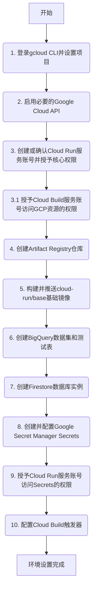

# 修订并补充的 Google Cloud Run 部署计划

## 目录
1. [项目架构概述](#项目架构概述)
2. [部署流程概览](#部署流程概览)
3. [一次性环境设置](#一次性环境设置)
   - [3.1 登录gcloud并设置项目](#31-登录gcloud并设置项目)
   - [3.2 启用Google Cloud API](#32-启用google-cloud-api)
   - [3.3 创建Cloud Run服务账号](#33-创建cloud-run服务账号)
   - [3.4 创建Artifact Registry仓库](#34-创建artifact-registry仓库)
   - [3.5 构建基础镜像](#35-构建基础镜像)
   - [3.6 创建BigQuery数据集](#36-创建bigquery数据集)
   - [3.7 创建Firestore数据库](#37-创建firestore数据库)
   - [3.8 配置Secret Manager](#38-配置secret-manager)
4. [持续部署流程](#持续部署流程)
5. [TWS安装日志说明](#tws安装日志说明)

---

## 项目架构概述


---

## 一次性环境设置

### 3.1 登录gcloud并设置项目
        ```bash
        # 登录gcloud CLI
        gcloud auth login

        # 设置项目ID
        gcloud config set project gold-gearbox-424413-k1
        ```

        ### 3.2 启用Google Cloud API
        ```bash
        gcloud services enable \
            cloudbuild.googleapis.com \
            run.googleapis.com \
            artifactregistry.googleapis.com \
            iam.googleapis.com \
            secretmanager.googleapis.com \
            bigquery.googleapis.com \
            firestore.googleapis.com \
            --project=gold-gearbox-424413-k1
        ```

### 3.3 创建Cloud Run服务账号
        ```bash
        PROJECT_ID="gold-gearbox-424413-k1"
        CR_SA_NAME="ib-trading"
        CR_SA_EMAIL="${CR_SA_NAME}@${PROJECT_ID}.iam.gserviceaccount.com"

        # 创建服务账号（如果不存在）
        gcloud iam service-accounts describe "${CR_SA_EMAIL}" \
            --project="${PROJECT_ID}" > /dev/null 2>&1 || \
        gcloud iam service-accounts create "${CR_SA_NAME}" \
            --display-name="IB Trading Cloud Run Service Account" \
            --project="${PROJECT_ID}"

        # 授予IAM角色
        gcloud projects add-iam-policy-binding "${PROJECT_ID}" \
            --member="serviceAccount:${CR_SA_EMAIL}" \
            --role="roles/secretmanager.secretAccessor"

        gcloud projects add-iam-policy-binding "${PROJECT_ID}" \
            --member="serviceAccount:${CR_SA_EMAIL}" \
            --role="roles/bigquery.user"

        gcloud projects add-iam-policy-binding "${PROJECT_ID}" \
            --member="serviceAccount:${CR_SA_EMAIL}" \
            --role="roles/bigquery.dataEditor"

        gcloud projects add-iam-policy-binding "${PROJECT_ID}" \
            --member="serviceAccount:${CR_SA_EMAIL}" \
            --role="roles/datastore.user"
        ```

### 3.4 创建Artifact Registry仓库
        ```bash
        PROJECT_ID="gold-gearbox-424413-k1"
        AR_LOCATION="europe"

        # 创建应用程序镜像仓库
        gcloud artifacts repositories describe cloud-run-repo \
            --location="${AR_LOCATION}" \
            --project="${PROJECT_ID}" > /dev/null 2>&1 || \
        gcloud artifacts repositories create cloud-run-repo \
            --repository-format=docker \
            --location="${AR_LOCATION}" \
            --description="Docker repository for Cloud Run ib-trading application" \
            --project="${PROJECT_ID}"

        # 创建基础镜像仓库
        gcloud artifacts repositories describe eu.gcr.io \
            --location="${AR_LOCATION}" \
            --project="${PROJECT_ID}" > /dev/null 2>&1 || \
        gcloud artifacts repositories create eu.gcr.io \
            --repository-format=docker \
            --location="${AR_LOCATION}" \
            --description="Repository for base images, named eu.gcr.io" \
            --project="${PROJECT_ID}"
        ```

### 3.5 构建基础镜像


### 3.6 创建BigQuery数据集
    ```bash
        PROJECT_ID="gold-gearbox-424413-k1"
        BQ_LOCATION="EU"
        DATASET_ID="historical_data"
        TABLE_ID="test"

        # 创建数据集
        bq show --project_id="${PROJECT_ID}" --format=prettyjson "${DATASET_ID}" > /dev/null 2>&1 || \
        bq --location="${BQ_LOCATION}" mk --dataset \
            --description="Dataset for historical trading data" \
            "${PROJECT_ID}:${DATASET_ID}"

        # 创建测试表
        bq show --project_id="${PROJECT_ID}" --format=prettyjson "${DATASET_ID}.${TABLE_ID}" > /dev/null 2>&1 || \
        bq mk --table \
            --description "Test table for integration tests" \
            "${PROJECT_ID}:${DATASET_ID}.${TABLE_ID}" \
            date:DATE,instrument:STRING,key:STRING,value:FLOAT64
    ```

### 3.7 创建Firestore数据库
        ```bash
        PROJECT_ID="gold-gearbox-424413-k1"
        FIRESTORE_LOCATION="asia-east1"

        # 通过gcloud创建Firestore数据库
        gcloud firestore databases create --location="${FIRESTORE_LOCATION}" --type=firestore-native \
            --project="${PROJECT_ID}" || echo "Firestore database likely already exists"
        ```

### 3.8 配置Secret Manager
        ```bash
        PROJECT_ID="gold-gearbox-424413-k1"
        SECRET_NAME="paper"

        # 创建secret容器
        gcloud secrets describe "${SECRET_NAME}" --project="${PROJECT_ID}" > /dev/null 2>&1 || \
        gcloud secrets create "${SECRET_NAME}" \
            --replication-policy="automatic" \
            --project="${PROJECT_ID}"

        # 添加secret版本（替换为您的真实凭据）
        gcloud secrets versions add "${SECRET_NAME}" --project="${PROJECT_ID}" \
        --data-file=- <<< '{"userid": "YOUR_PAPER_USERID", "password": "YOUR_PAPER_PASSWORD"}'

        # 授予Cloud Run服务账号访问权限
        gcloud secrets add-iam-policy-binding "${SECRET_NAME}" \
            --member="serviceAccount:ib-trading@${PROJECT_ID}.iam.gserviceaccount.com" \
            --role="roles/secretmanager.secretAccessor" \
            --project="${PROJECT_ID}"
        ```

---

## 持续部署流程
```bash
# 1. 确保代码是最新的
git pull origin master

# 2. 运行Cloud Build部署
GIT_TAG=$(git rev-parse --short HEAD)
gcloud builds submit --config cloud-run/application/cloudbuild.yaml \
  --substitutions=_TRADING_MODE=paper,_GCP_REGION=asia-east1,_MY_IMAGE_TAG=${GIT_TAG:-manual-latest} .

# 3.如果出现运行结果错误，可以读取日志，以查错
gcloud run services logs read ib-paper --region asia-east1 --limit 100

# 4.出现问题删除cloud-run 
gcloud run services delete ib-paper --region asia-east1
```


---

## TWS安装日志说明
在`cloudbuild.yaml`的集成测试步骤中配置环境变量：

```yaml
- name: 'gcr.io/cloud-builders/docker'
  args: [
      'run',
      '--network', 'cloudbuild',
      '--volume', '/workspace:/workspace',
      '--env', 'MOCK_TWS_VERSION=981',     # 提供模拟版本
      '--env', 'TWS_INSTALL_LOG=/tmp/dummy_install.log', # 指向空文件
      ...
  ]
```

