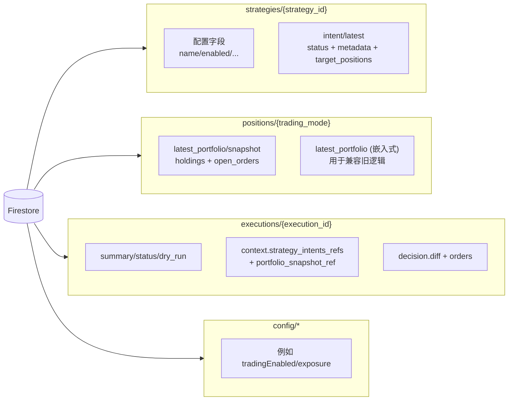

# “策略即意图”架构升级方案：引入“总指挥”模式

## 1. 概述

本文档旨在提出一个对现有“策略即意图”架构的升级方案。当前架构虽然实现了策略的模块化，但在多策略协调、全局风险管理和应对外部手动交易方面存在短板。

新方案将重新引入“总指挥”模式的核心思想，但以一种更现代化、更具扩展性的方式，构建一个**“信号生成”与“交易执行”相分离**的混合架构。

**核心目标:**

*   **集中执行**: 所有交易指令由唯一的“总指挥”意图（Commander）发出，便于统一管理风险和资金。
*   **分散决策**: 每个策略作为一个独立的“信号生成器”，只负责声明其理想的目标持仓，易于开发、测试和维护。
*   **状态清晰**: 利用 Firestore 作为“意图总线”，清晰记录每个策略的期望状态、系统的真实状态以及总指挥的决策过程，提高可追溯性和可调试性。
*   **兼容手动交易**: 通过定期的“对账”步骤，系统能够感知并适应在IB TWS等终端上的手动仓位调整。

---

## 2. 新架构设计

新架构包含三个核心组件：**策略意图 (Strategy Intent)**、**对账意图 (Reconciliation Intent)** 和 **总指挥意图 (Commander Intent)**。

### 2.1 工作流程

整个自动化交易流程由 Cloud Scheduler (`orchestrator-daily-run`) 调用 Cloud Run 服务根路径 `POST /` 触发，FastAPI 会将该请求代理到 `orchestrator` 意图，并在单个 HTTP 调用里串行完成三段式流水线。由于多策略仍属中低频运行，一个 Scheduler 作业即可覆盖，无需额外的 Workflows/多作业编排。

**步骤 1: 策略计算 (串行触发)**
*   Orchestrator 读取 `strategies` 配置或显式 payload，依次运行 `STRATEGY_INTENT_REGISTRY` 内注册的意图（当前为 `spy_macd_vixy`、`testsignalgenerator`）。
*   每个策略拉取所需行情（IB、市价/指标）并只输出**目标仓位** (Target Position)；不会直接下单。
*   策略以 Firestore 文档 `strategies/{strategy_id}/intent/latest` 为唯一输出，写入 `status`、`metadata`、`target_positions`，Commander 通过 `updated_at` 判断是否在有效窗口内。

**步骤 2: 真实状态对账**
*   Orchestrator 可选地（默认 `runReconcile=true`）调用 `reconcile` 意图。
*   `reconcile` 连接 IB，获取真实**持仓**、**在途订单**、**账户指标**。
*   它将这些信息写入 `positions/{trading_mode}/latest_portfolio/snapshot`，并保留嵌入式 `positions/{trading_mode}` → `latest_portfolio` 以兼容遗留脚本；Commander 读取 snapshot 路径为事实来源。
*   运行频率与策略窗口一致即可（例如每日盘后一次），执行前无需加锁，只要在 Commander 前完成即可。

**步骤 3: 总指挥决策与执行**
*   编排函数在对账完成后，调用 `allocation` (总指挥) 意图。
*   总指挥执行以下操作：
    1.  **读取真实状态**: 首选 `positions/{mode}/latest_portfolio/snapshot`（若缺失则回退至嵌入式 `latest_portfolio`）。
    2.  **读取所有意图**: 遍历 `strategies` 集合，读取所有启用策略写入的“目标持仓”。
    3.  **综合与决策**:
        *   将所有策略的目标持仓聚合成“理想最终组合”，并记录贡献者列表。
        *   应用全局风险规则、预算拆分与 guardrail（如 `allowed_symbols`, `max_notional`, `exposure` 配额）。
        *   计算出从“真实状态”到“理想的最终组合”所需执行的具体交易订单（买/卖/调整）。
    4.  **执行交易**: 向 IB Gateway 发送所有计算出的交易订单。
    5.  **记录决策**: 将本次执行的完整上下文（读取的真实状态、各策略意图、最终决策、发出的订单）写入一个新的日志文档中（例如 `executions/{execution_id}`），用于审计和调试。

### 2.2 架构图

```mermaid
graph TD
    Scheduler[Cloud Scheduler<br/>orchestrator-daily-run] --> CloudRun[/Cloud Run Service<br/>POST / → Orchestrator/]
    CloudRun --> StrategyA[Strategy: spy_macd_vixy]
    CloudRun --> StrategyB[Strategy: testsignalgenerator]
    CloudRun --> Reconcile[Reconcile Intent]
    CloudRun --> Commander[Commander Intent]

    subgraph "Firestore Intent Bus"
        StrategyA -- "write target" --> IntentA[strategies/spy_macd_vixy/intent/latest]
        StrategyB -- "write target" --> IntentB[strategies/testsignalgenerator/intent/latest]
        Reconcile -- "write snapshot" --> PortfolioState[positions/{mode}/latest_portfolio/snapshot]
        Commander -- "read" --> IntentA
        Commander -- "read" --> IntentB
        Commander -- "read" --> PortfolioState
        Commander -- "write audit" --> Executions[executions/{exec_id}]
    end

    subgraph "IB Gateway"
        StrategyA -- "market data" --> IB[(IB)]
        StrategyB -- "market data" --> IB
        Reconcile -- "positions/orders" --> IB
        Commander -- "place orders" --> IB
    end
```

---

## 3. Firestore 数据库设计

为了支撑新的混合架构，我们需要对 Firestore 的结构进行重新设计。

### 3.1 `strategies` 集合

此集合用于管理所有策略的配置和意图。

*   **路径**: `strategies/{strategy_id}`
*   **文档内容**:
    ```json
    {
      "name": "SPY MACD VIXY Strategy",
      "description": "基于SPY的MACD指标和VIXY作为对冲的波段策略",
      "enabled": true,
      "author": "system",
      "capital_allocation": 0.6, // 分配给此策略的资金占总投资组合的比例
      "risk_parameters": {
        "max_drawdown": 0.15,
        "max_single_position_exposure": 0.4
      }
    }
    ```
*   **子集合**: `strategies/{strategy_id}/intent`
    *   **路径**: `strategies/{strategy_id}/intent/latest`
    *   **文档内容 (由策略意图写入)**:
        ```json
        {
          "updated_at": "2025-10-29T16:10:00Z",
          "status": "success", // "success" or "error"
          "error_message": null,
          "metadata": {
            "signal_strength": 0.85,
            "indicators": {
              "macd_hist": 12.34,
              "vixy_level": 25.5
            }
          },
          "target_positions": [
            {
              "symbol": "SPY",
              "secType": "STK",
              "exchange": "SMART",
              "currency": "USD",
              "quantity": 100,
              "price": 450.12,
              "contract": { ... } // lib.ib_serialization.contract_to_dict 输出
            },
            {
              "symbol": "VIXY",
              "secType": "STK",
              "exchange": "SMART",
              "currency": "USD",
              "quantity": -50,
              "price": 17.45,
              "contract": { ... }
            }
          ]
        }
        ```
    *   中长期策略只需在各自运行窗口内写入一次数据；Commander 通过 `updated_at` 与窗口起始时间比对，跳过陈旧或缺失的意图。

### 3.2 `positions` 集合

此集合用于存储从券商同步的真实账户状态（含快照与兼容层）。

*   **路径**: `positions/{trading_mode}/latest_portfolio/snapshot`（例如 `positions/paper/latest_portfolio/snapshot`）。  
    `reconcile` 首选写入该文档，同时在 `positions/{trading_mode}` 根文档内以 `latest_portfolio` 字段形式保留同一份 payload，方便旧脚本在迁移期间继续读取。
*   **文档内容 (由 `reconcile` 意图写入)**:
    ```json
    {
      "updated_at": "2025-10-29T16:15:00Z",
      "net_liquidation": 150000.00,
      "available_funds": 80000.00,
      "holdings": [
        {
          "symbol": "SPY",
          "quantity": 80,
          "avgCost": 440.50,
          "contract": { ... } // lib.ib_serialization.contract_to_dict 输出
        }
      ],
      "open_orders": [
        {
          "orderId": 123,
          "symbol": "AAPL",
          "action": "BUY",
          "totalQuantity": 50,
          "remainingQuantity": 50,
          "status": "Submitted",
          "order": { ... },   // lib.ib_serialization.order_to_dict 输出
          "contract": { ... }
        }
      ]
    }
    ```
*   Commander 先读取 snapshot 文档，如缺失则退回到嵌入式 `latest_portfolio`，并将引用指纹（`positions/{mode}/latest_portfolio/snapshot@timestamp`）记录在 `executions` 文档中。

### 3.3 `executions` 集合

此集合作为总指挥决策的审计日志。

*   **路径**: `executions/{execution_id}` (文档ID可以是UUID或执行时间戳)
*   **文档内容 (由 `allocation` 总指挥意图写入)**:
    ```json
    {
      "executed_at": "2025-10-29T16:20:00Z",
      "trigger": "scheduled", // "scheduled" or "manual"
      "status": "completed", // "completed", "failed", "partial_success"
      "summary": "Placed 2 orders: BUY 20 SPY, SELL 50 VIXY.",
      "context": {
        "portfolio_snapshot_ref": "positions/paper/latest_portfolio/snapshot@2025-10-29T16:15:00Z",
        "strategy_intents_refs": [
          "strategies/spy_macd_vixy/intent/latest@2025-10-29T16:10:00Z",
          "strategies/testsignalgenerator/intent/latest@2025-10-29T16:11:00Z"
        ]
      },
      "decision": {
        "aggregated_target": [ ... ],
        "final_target": [ ... ],
        "diff": [ ... ]
      },
      "orders_placed": [
        {
          "orderId": 124,
          "symbol": "SPY",
          "action": "BUY",
          "totalQuantity": 20,
          "status": "Submitted"
        },
        {
          "orderId": 125,
          "symbol": "VIXY",
          "action": "SELL",
          "totalQuantity": 50,
          "status": "Submitted"
        }
      ]
    }
    ```
*   由于执行频率较低，可将详细上下文（如完整持仓快照、策略信号）写入 Cloud Logging 或 GCS 对象中，仅在文档内保留引用指纹，降低 Firestore 文档体积。

### 3.4 `config` 集合

`config` 集合保持不变，继续用于存储全局配置，如 `tradingEnabled` 开关。总指挥和所有策略意图在执行前都应检查此开关。

### 3.5 Firestore 结构图



---

## 4. 实施建议

1.  **策略输出目标仓位**: 确保 `spy_macd_vixy`、`test_signal_generator` 等意图只负责计算目标持仓并写入 `strategies/{strategy_id}/intent/latest` 文档，不直接触发交易。
2.  **实现 `reconcile` 意图**: 创建或完善 `reconcile` 意图，使其能准确获取 IB 的持仓和在途订单，并写入 `positions/{trading_mode}/latest_portfolio/snapshot`（同时 merge 到父文档的 `latest_portfolio` 字段以兼容旧逻辑）。
3.  **重构 `allocation` 意图**: 将 `allocation` 意图重构为“总指挥”，实现本文档第 2.1 节描述的决策逻辑。
4.  **调整计划任务**: 使用单个 Cloud Scheduler 作业（现名 `orchestrator-daily-run`），直接向 Cloud Run 服务发送 `POST /` 请求，payload 形如 `{"strategies": ["testsignalgenerator","spy_macd_vixy"], "dryRun": true, "runReconcile": true}`，由 FastAPI 内部顺序执行 `策略 -> 对账 -> 总指挥`。
5.  **增量迁移**: 可以先从一个策略开始迁移，验证整个流程跑通后，再逐步将更多策略加入到这个新架构中。

通过此方案，系统将获得一个既灵活又稳健的指挥体系，为未来扩展更复杂的策略组合和风控模型打下坚实的基础。

---

## 5. 推荐的分阶段验证流程

1. **本地 Dry-Run**  
   * 在启用虚拟环境并安装依赖后，运行 `python3 -m unittest`。  
   * 使用 `uvicorn main:app --reload` 启动服务，手动调用 `POST /`（或直接 `POST /orchestrator`），请求体设置 `{"strategies": ["testsignalgenerator", "spy_macd_vixy"], "dryRun": true, "runReconcile": false}`，确认 Firestore 写入逻辑不会触发真实下单。

2. **Sandbox / Staging 环境**  
   * 部署新的 Cloud Run 服务（例如 `trading-orchestrator-staging`），仅配置仿真账户凭据。  
   * 通过 Cloud Scheduler 或手动 `curl` 触发 `POST /`，检查以下 Firestore 文档：
     - `strategies/<id>/intent/latest` 更新 `updated_at` 且无错误。
     - `positions/{mode}/latest_portfolio/snapshot` 被 `/reconcile` 刷新（如需兼容旧脚本，可验证父文档的 `latest_portfolio` 字段同步更新）。  
     - `executions/{execution_id}` 包含 `aggregated_target`、`diff` 等字段。

3. **审计与观察**  
   * 在 Cloud Logging 中确认 orchestrator、reconcile、allocation 三段日志均成功，且 Commander 未对 `missing_strategies`、`stale_strategies` 报警。  
   * 对比 staging 与 baseline (`testsignalgenerator`) 的输出，确保 Commander 汇总的 `diff` 与策略单独计算的 `proposed_delta` 一致。

4. **灰度生产**  
   * 为生产账号创建独立 Cloud Run 修订，先以 `dryRun=true` 执行 1-2 个交易日，验证审计文档与日志。  
   * 切换 Cloud Scheduler 至 orchestrator 端点，同时保留旧的 `testsignalgenerator` 调度作为回滚手段。  
   * 一旦 Commander 输出稳定，再逐步将其他策略迁移到新的意图模型，最后停用旧意图。


附：定时作业的作用描述
  - 这个 orchestrator-daily-run 定时任务每个交易日触发一次 Cloud Run 根路径 /，请求体 {strategies:
    ["testsignalgenerator","spy_macd_vixy"],dryRun:true,runReconcile:true}。它将 intent_strategy_upgrade.md 里描述的三步流水线（策略 → 对账
    → Commander）串在一次 HTTP 调用内完成，取代旧时代分别调用 /testsignalgenerator、/reconcile、/allocation 的多个 Scheduler 作业。

  如何区分三大组件的执行结果

  1. 策略意图（Strategy Intents）
      - Cloud Run 日志里会先看到 --- Starting Robust, Target-Aware Signal Generator ---、Fetch 5D/30min... 这样的 INFO 行。
      - Firestore 路径 strategies/<id>/intent/latest 会更新 updated_at、status、target_positions。
      - verify_trading.py --show-intents 会在 “Strategy Breakdown” 段落列出每个策略的执行时间与目标仓位。
  2. 对账意图（Reconcile）
      - 日志出现 Starting portfolio reconciliation against IB Gateway... 以及多条 ib_insync.wrapper:position / updatePortfolio 输出。
      - Firestore 文档 positions/paper/latest_portfolio/snapshot 被覆盖，含实时 holdings、open_orders、net_liquidation（父文档的
        latest_portfolio 字段也会同步）。可从控制台或 gcloud firestore documents describe 查看。
  3. 总指挥（Commander / Allocation）
      - 日志记录 Planned X orders; simulated Y、orders 等信息。
     - Firestore executions/{auto_id} 新增一条执行日志（字段 decision.diff、orders 等）。
     - verify_trading.py 输出 “Commander” 段落，列出 dry-run 结果与计划订单。

  推荐操作流程

  1. 安排作业执行后，先用

     gcloud logging read 'resource.type="cloud_run_revision" AND resource.labels.service_name="ib-paper"' \
       --project=gold-gearbox-424413-k1 --freshness=10m --format="value(timestamp,textPayload)"
     快速确认三段日志是否依次出现。
     快速确认三段日志是否依次出现。
  2. 打开 Firestore Console 或脚本读取上述三个路径，验证数据刷新时间。
  3. 如需人工复核，运行：

     python verify_trading.py --show-intents --project-id gold-gearbox-424413-k1 --strategies testsignalgenerator spy_macd_vixy

     对照输出中 “策略” / “Commander” 段落是否与日志一致。


附：“IB 就绪”探针；
并没有两万的方法。
FastAPI 的 GET / 只说明应用跑着，不能判断 IB 背景线程是否已经连上网关。比较现实的办法是打一个最轻量的
  IB 相关 intent，看它能否在超时时间内返回成功。

  你可以用 reconcile 这个 intent（它只拉一次持仓，不会触发交易），命令如下：

  curl -X POST "${ORCHESTRATOR_URL}/reconcile" \
    -H "Authorization: Bearer $(gcloud auth print-identity-token)" \
    -H "Content-Type: application/json" \
    -d '{"dryRun": true}'

  - 如果 IB 背景线程已经连上，这个请求会在几秒内返回包含 holdings/open_orders 的 JSON。
  - 如果还在重连（或网关未就绪），你会看到 {"error": "...Connection..."}、{"error": "Service is busy"} 或 {"error": "Request timed out"}，那
    就再等一会或观察日志里是否出现 IB Thread (Outer Loop): Successfully connected. 之后再重试。

  通过这个 curl 成功响应，就说明 IB 已经进入可执行状态，随后再跑 orchestrator 就不会因为冷启动而超时了。

---

## 6. 当前进展与待办（2025-11-09）

### 已完成（来自 `conversation_log.md` / `进展对照intent_strategy_upgrade.md`）
- `testsignalgenerator`、`spy_macd_vixy` 已完全迁移到“写 Firestore 目标仓位”的策略模型，Commander 只读 `positions/{mode}/latest_portfolio/snapshot` 做集中决策。
- FastAPI 根路由 `POST /` 已代理到 orchestrator，按“策略→对账→Commander”顺序执行，并在 503 时正确暴露 IB 重连状态；`GET /` 提供健康检查。
- Reconcile 意图升级为写 `latest_portfolio/snapshot`（并保留嵌入式字段），`lib/ib_serialization` 负责 contract/order 序列化，Commander/verify_trading 已适配新结构。
- 全量单测 (`python -m unittest discover -s _tests -t .`) 通过，`verify_trading.py --show-intents` 与 Cloud Run `curl POST /` dry-run 均验证策略成功、Commander missing/stale 为空。
- Guardrail 与预算脚本 `scripts/firestore/setting_firestore.py` 已写入 `allowed_symbols`、`max_notional` 等限制，Commander `_apply_guardrails` 在 Cloud Run dry-run 中确认能够裁剪超额目标。

### 待完成事项
1. **Cloud Run 部署 / Scheduler 切换**：重新部署含 guardrail/日志改动的镜像，并在运维批准后将 `orchestrator-daily-run` payload 由 `dryRun:true` 切为 `dryRun:false`，以恢复真实下单（见 `conversation_log.md` 11-9 “Next steps before going live”）。
2. **多策略迁移**：除上述两条策略外，其余生产策略仍在旧意图/脚本，需要依照第 3.1 节流程补齐 Firestore 配置、预算、guardrail，再加入 orchestrator（`进展对照intent_strategy_upgrade.md` 第 2 条）。
3. **Secret / 凭证治理**：审查并制定 `ib-*-username/password` Secret Manager 版本的轮换与失效检测，避免凭证过期造成 503（`进展对照intent_strategy_upgrade.md` 第 3 条）。
4. **监控 & 告警**：为 orchestrator 503、请求超时以及 IB 断线建立 Cloud Logging Metric 或 Error Reporting 告警链路，覆盖 Scheduler 成功率监测（`进展对照intent_strategy_upgrade.md` 第 5 条）。
5. **预算配置校准（进行中）**：已启动对 `config/common.exposure.strategies` 的重写，将按 33%/33%/34%（或运营确认的新版配额）落盘，并同步验证 Commander 输出/`verify_trading.py` 的 Strategy Exposure，防止任何单策略独占整体资金（参考 `conversation_log.md` 第 19 节备注）。
